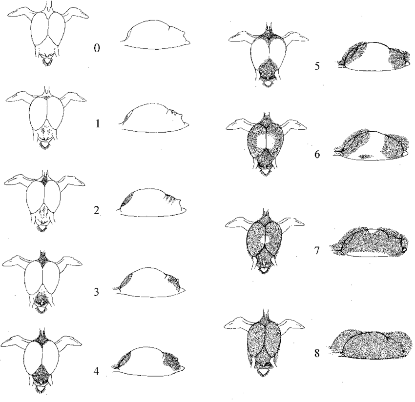

```{r setup, include=FALSE}
knitr::opts_chunk$set(echo = TRUE)
```

### Pacotes
```{r message=FALSE, warning=FALSE}
library(psych)
library(summarytools)
library(performance)
library(MASS)
library(dplyr)
library(rstatix)
library(lmtest)
library(car)
library(ggpubr)
```

### Base de dados a ser analisada
```{r}

df <- read.csv('https://raw.githubusercontent.com/JessicaHemily/COMP_1/main/LeukocyteProfiles.csv/LeukocyteProfiles.csv', 
				  header = TRUE,
				  sep = ',')

head(df)

#df_2 <- df[df$Species == "Calidris temminckii",]
#linha <- nrow(df_2)
#linha

```

### 1. Compreensão dos dados

**VARIÁVEIS**

**FatScore:** Escore de gordura que varia de 0 a 8;




**BodyMass:** Massa do pássaro;

**Heterophils:** Heterófilos são fagócitos-chaves fundamentais para a defesa imunológica das aves. Eles se ligam e detectam patógenos invasores através do uso de receptores Toll-like (TLRs), receptores Fc e receptores de complemento;

**Lymphocytes:** Linfócitos são um tipo de leucócito ou glóbulo branco do sangue, responsáveis pelo reconhecimento e destruição de micro-organismos infecciosos como bactériase vírus;

**Eosinophils:** 

**Monocytes:**

**Basophils:**

**HLRatio:**

```{r}
glimpse(df)
summary(df)
```

#### Espécies e número de indíviduos
```{r}
cbind(table(df$Species))
```

### Outliers

```{r fig.align='center', fig.height=10, fig.width=15, message=FALSE, warning=FALSE}
par(mfrow = c(2,4))
for (coluna in c(2:9)) {
  variavel <- names(df)[coluna]
  boxplot(df[coluna],main = variavel)
}
```

Há poucos outliers na base de dados

### NAs na base?

```{r}

df_na <- df[!complete.cases(df),]
head(df_na)   

```
```{r}
linhas_na <- nrow(df_na)
linhas_df <- nrow(df)
linhas_na

cat("A base de dados possui",linhas_df, "observacoes e",linhas_na, "linhas contendo ao menos um NA")
```
### Identificar as variáveis que possuem NAs

```{r}

cbind(colSums(is.na(df)))

```
### Cáluculo da média de bodymass para substituição dos valore NAs

```{r}

media_bm <- mean(df$BodyMass,na.rm = TRUE)

```

### Substituir os NAs pela média 
```{r}
df$BodyMass <- (replace(x = df$BodyMass,
                               list = is.na(df$BodyMass),
                               values = media_bm)
                                )

```

### Modelo

```{r}

modelo <- lm(FatScore~ BodyMass + Heterophils + Lymphocytes + Eosinophils + Monocytes + Basophils + HLRatio, data = df)
  
```

```{r fig.align='center', fig.height=15, fig.width=15, message=FALSE, warning=FALSE}
par(mfrow = c(2,2))
plot(modelo)

```

```{r fig.align='center', fig.height=15, fig.width=15, message=FALSE, warning=FALSE}
pairs.panels(df[,-1])

```
Há multicolinearidade entre as variáveis "Heterophils" e "Lymphocytis", devido ao r > 0,8 (r = - 0,91).


