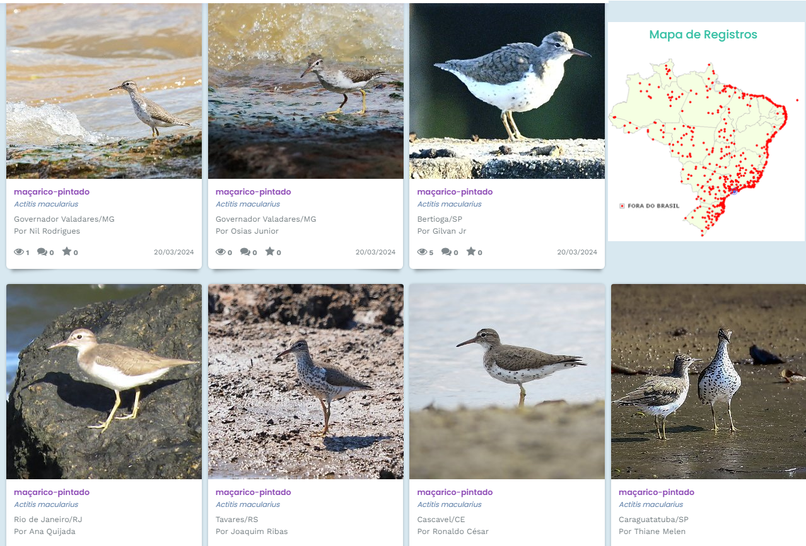
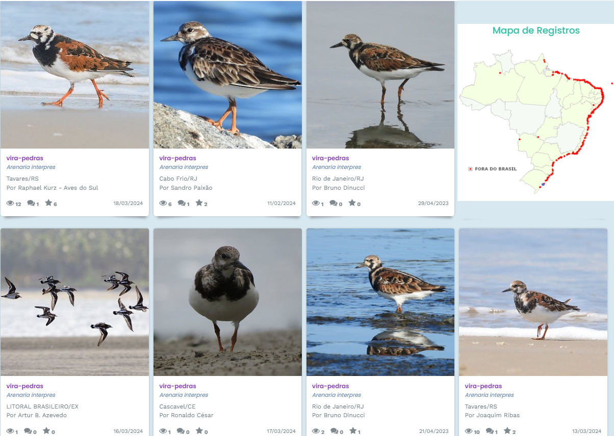
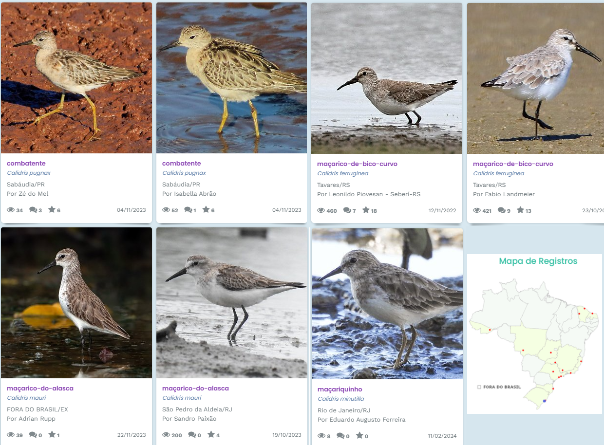
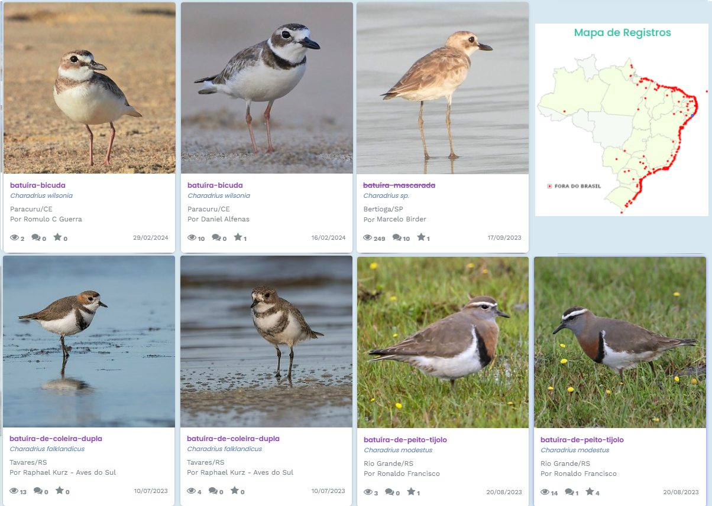
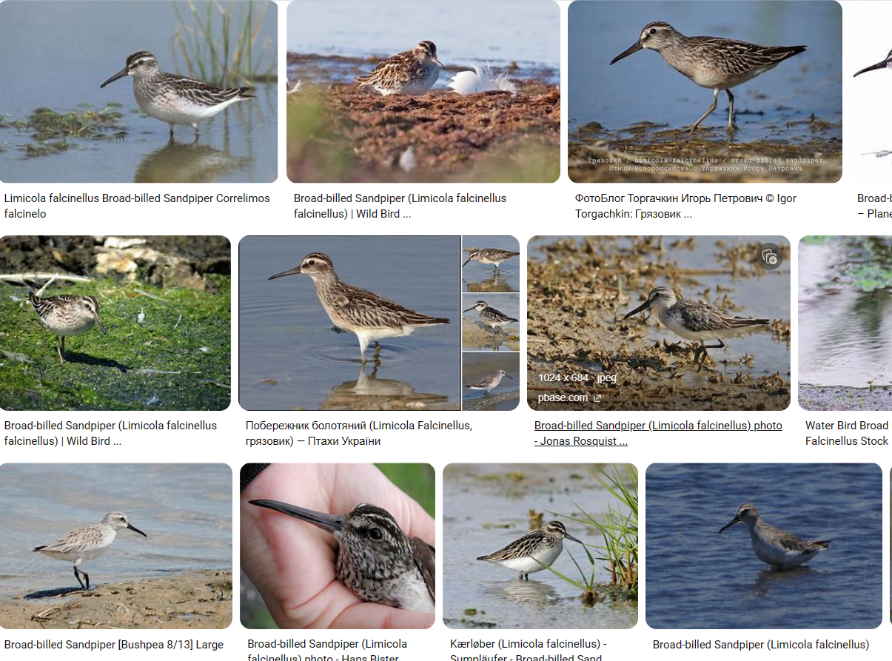
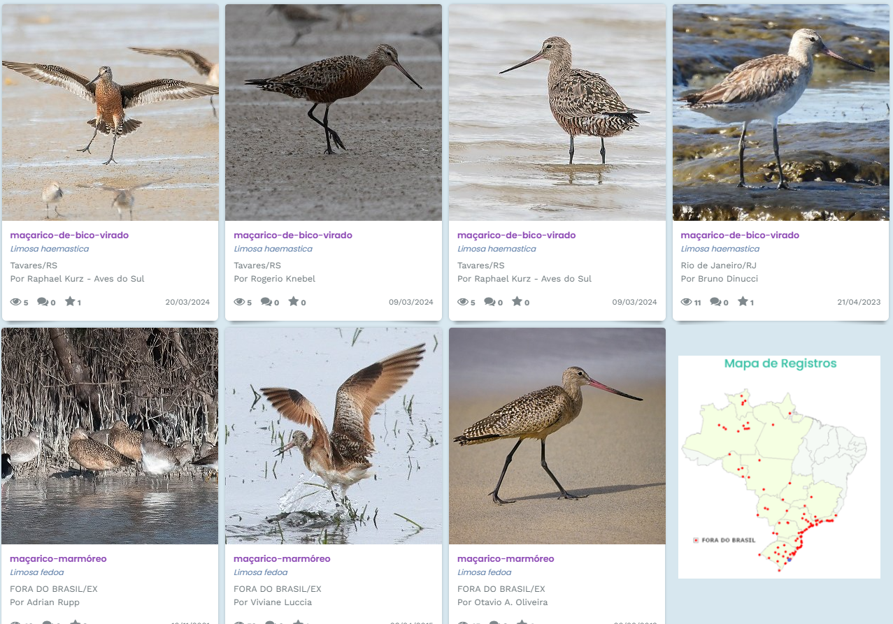
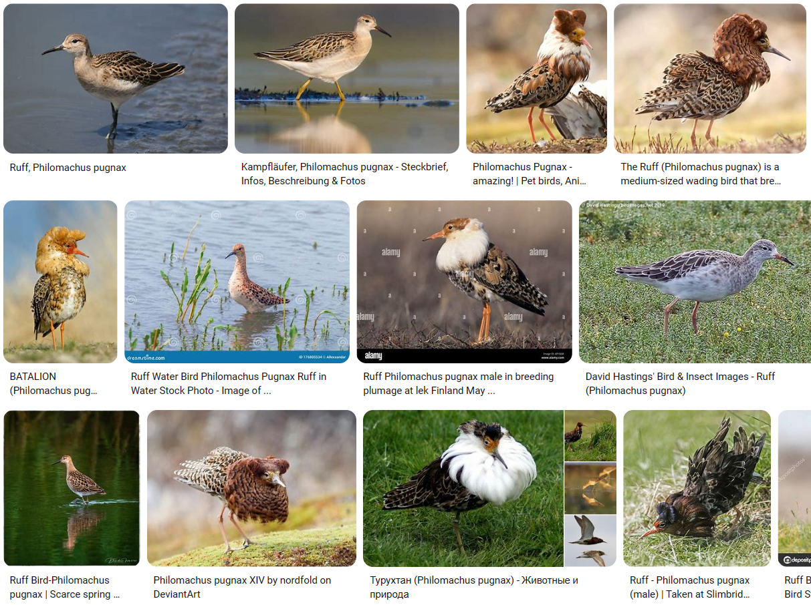
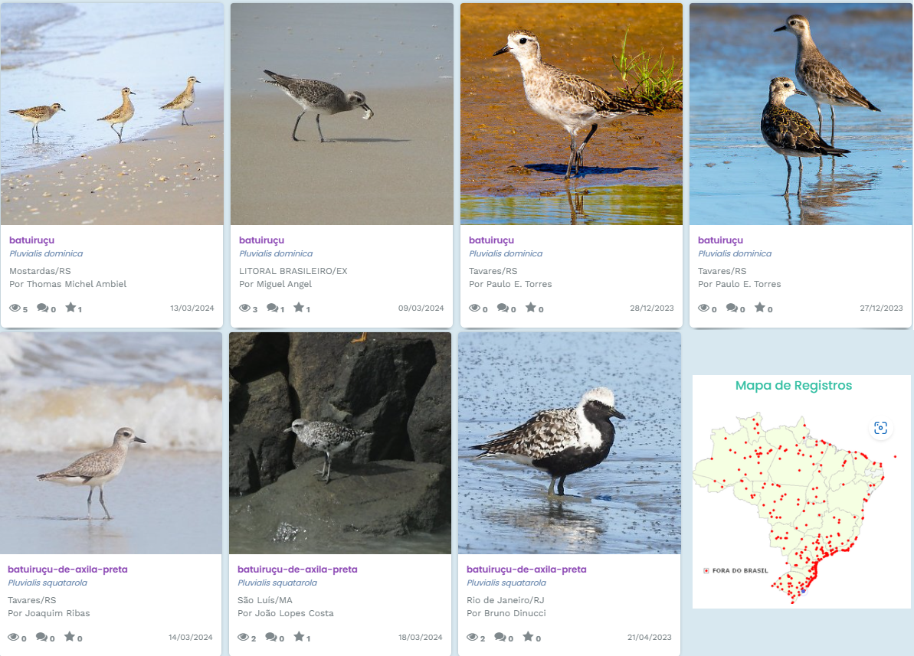
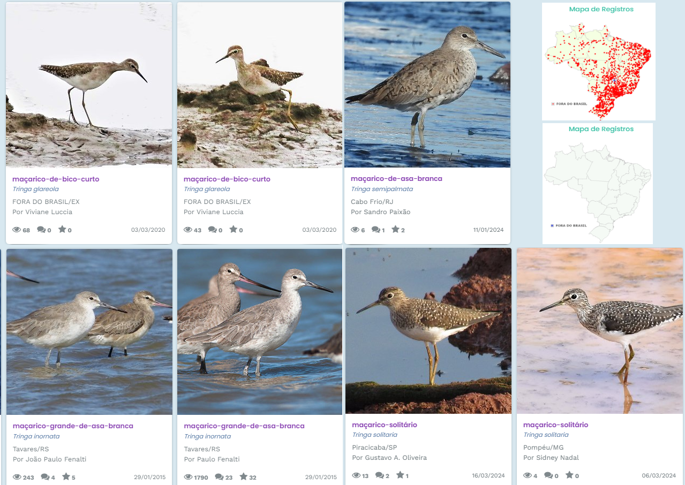
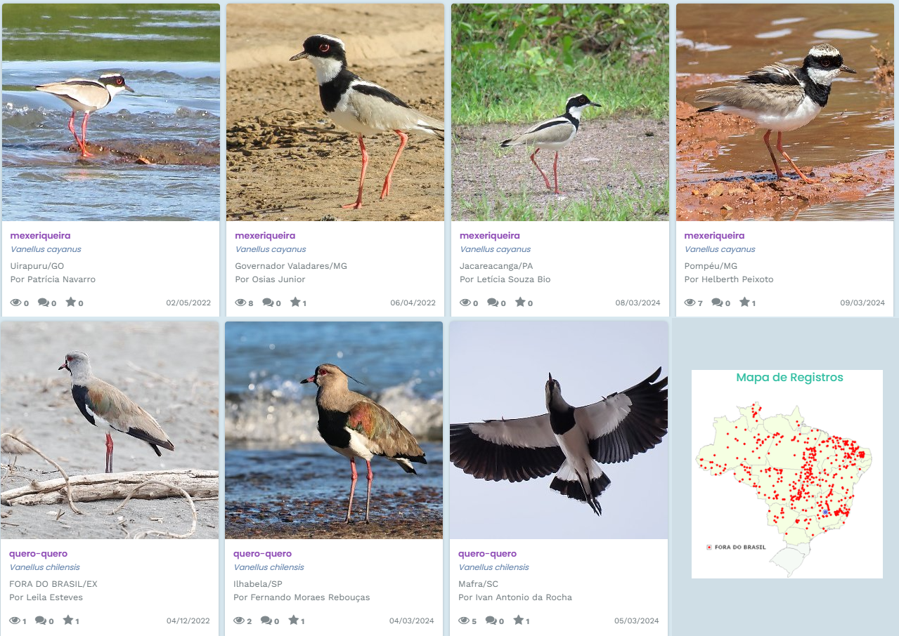

### Pacotes
```{r message=FALSE, warning=FALSE}
library(psych)
library(summarytools)
library(performance)
library(MASS)
library(dplyr)
library(rstatix)
library(lmtest)
library(ggpubr)
library(nnet)
library(tidyr)
library(car)
library(agricolae)
library(ExpDes.pt)
library(hnp)
```

### Base de dados a ser analisada
```{r }

df <- read.csv('https://raw.githubusercontent.com/JessicaHemily/COMP_1/main/LeukocyteProfiles.csv/LeukocyteProfiles.csv', 
				  header = TRUE,
				  sep = ',')

head(df)

#df_2 <- df[df$Species == "Calidris temminckii",]
#linha <- nrow(df_2)
#linha


```

## **1. Compreensão dos dados**

**VARIÁVEIS**

**FatScore:** Escore de gordura que varia de 0 a 8;


**BodyMass:** Massa do pássaro;

**Heterophils:** Heterófilos são fagócitos-chaves fundamentais para a defesa imunológica das aves. Eles se ligam e detectam patógenos invasores através do uso de receptores Toll-like (TLRs), receptores Fc e receptores de complemento;

**Lymphocytes:** Linfócitos são um tipo de leucócito ou glóbulo branco do sangue, responsáveis pelo reconhecimento e destruição de micro-organismos infecciosos como bactériase vírus;

**Eosinophils:** Os eosinófilos são um dos vários glóbulos brancos que sustentam o sistema imunológico e fazem parte do sistema de defesa do seu corpo contra alérgenos além de ajudar a protegê-lo contra infecções fúngicas e parasitárias. 
Comp: Dependendo da contagem de eosinófilos, a eosinofilia pode ser leve, moderada ou grave. Níveis elevados de eosinófilos podem indicar uma condição leve, como reação a medicamentos ou alergia, ou uma condição grave pode causar isso, incluindo algumas doenças do sangue. Um grande número de eosinófilos se aglomera em áreas específicas do corpo, causando problemas médicos ligados à inflamação que podem afetar várias áreas do corpo. 

(https://my.clevelandclinic.org/health/diseases/17710-eosinophilia)

**Monocytes:** Os monócitos são um tipo de glóbulo branco do sistema imunológico, em que se transformam em macrófagos ou células dendríticas quando um germe ou bactéria invasora entra em seu corpo. As células matam o invasor ou alertam outras células sanguíneas para ajudar a destruí-lo e prevenir a infecção.

(https://my.clevelandclinic.org/health/body/22110-monocytes)


**Basophils:** Os basófilos são um tipo de glóbulo branco que trabalha em estreita colaboração com o sistema imunológico para defender o corpo contra alérgenos, patógenos e parasitas, em que liberam enzimas para melhorar o fluxo sanguíneo e prevenir coágulos sanguíneos.

(https://my.clevelandclinic.org/health/body/23256-basophils)

**HLRatio** Proporção Heterófilo: Linfócito (H:L):O valor dos heterofilos dividido pelo valor dos linfócitos resulta na relação ou proporção heterofilo:linfócito (H:L). Pode ser utilizada para avaliar o grau de estresse em aves. A proporção de linfócitos e heterófilos (H/L) é indicador confiável do estresse e os ecologistas tem utilizado essa proporção para medir o estado de saúde das aves. Também permite avaliar a resposta do organismo ao estresse de curto e longo prazo induzido, entre outros, pelo ambiente envolvente, estresse social, parasitas sanguíneos ou um maior gasto energético das fêmeas durante a reprodução. 
Segundo Gross e Siegel (1993), os valores de H:L utilizados para caracterizar os níveis de estresse em frangos de corte são:

  - 0,2 = indica grau leve de estresse;
  - 0,5 = estresse intermediário ou moderado (achei também que acima de 0,7 é moderado);
  - 0,8 = estresse alto.

Existem lugares que falam que as causas do aumento de H:L é devido a elevação da temperatura além do limite de conforto térmico para as aves (estresse por calor diminui a imunidade das aves), além disso, é possível citar também  a restrição alimentas, lotação, medo, traumatismo e entre outros.


(https://bioone.org/journals/acta-ornithologica/volume-53/issue-2/00016454AO2018.53.2.001/Variation-of-Heterophil-to-Lymphocyte-Ratio-in-the-Great-Tit/10.3161/00016454AO2018.53.2.001.short#)


## Resumo dos Dados

```{r fig.align='center', fig.height=10, fig.width=15, message=FALSE, warning=FALSE}
summary(df)
glimpse(df)
```

A variável FatScore é do tipo qualitativa ordinal

```{r}
#df$FatScore <- as.character(df$FatScore)

```


### **2. Variável de Interesse**

A variável que se deseja modelar é a variável contínua **HLRatio**.

```{r}
hist(df$HLRatio)

```
   
### Outliers
```{r fig.align='center', fig.height=10, fig.width=15, message=FALSE, warning=FALSE}
par(mfrow = c(2,4))
for (coluna in c(2:9)) {
  variavel <- names(df)[coluna]
  boxplot(df[,coluna],main = variavel)
  }
```


Devido as diferentes espécies em estudo, é esperado que haja variabilidade dos dados.

### Espécies e número de indíviduos
```{r}
cbind(table(df$Species))

n_species <- length(cbind(table(df$Species)))

cat("A base de dados apresenta ",n_species, " espécies distintas")
```

### Levantamento de idéias 

   * Talvez seja interessante agregar o gênero da variável "Species" (retirar a espécie da nomenclatura binomial) para a criação do moledo;
  * Talvez seja interessante agrupar os gêneros por família;
  * A variável resposta é do tipo contínua;
  * Possível regressão linear lm(), devido a variável resposta ser contínua.

### Vamos agrupar as espécies por família

* **Scolopacidae**

  * *Actitis hypoleucos;*
  
      Fonte: https://www.marinespecies.org/aphia.php?p=taxdetails&id=212603
      
  * *Arenaria interpres;*
  
      Fonte: https://www.marinespecies.org/aphia.php?p=taxdetails&id=147431
  
  * *Calidris alpina;*
  
      Fonte: https://www.marinespecies.org/aphia.php?p=taxdetails&id=159047
  
  * *Calidris canutus;*
  
      Fonte: https://www.marinespecies.org/aphia.php?p=taxdetails&id=147433
  
  * *Calidris ferruginea;*
  
      Fonte: https://www.marinespecies.org/aphia.php?p=taxdetails&id=159049
  
  * *Calidris minuta;*
  
      Fonte: https://www.marinespecies.org/aphia.php?p=taxdetails&id=212600
  
  * *Calidris temminckii;*
  
      Fonte: https://www.marinespecies.org/aphia.php?p=taxdetails&id=366591#distributions
  
  * *Limicola falcinellus;*
  
      Fonte: https://www.marinespecies.org/aphia.php?p=taxdetails&id=212621
  
  * *Limosa lapponica;*
  
      Fonte: https://www.marinespecies.org/aphia.php?p=taxdetails&id=159034
  
  * *Philomachus pugnax;*
  
      Fonte: https://www.marinespecies.org/aphia.php?p=taxdetails&id=159046
  
  * *Tringa erythropus;*
  
      Fonte: https://www.marinespecies.org/aphia.php?p=taxdetails&id=159029
  
  * *Tringa glareola;*
  
      Fonte: https://www.wikiaves.com.br/wiki/macarico-de-bico-curto
  
  * *Tringa nebularia;*
  
      Fonte: https://www.marinespecies.org/aphia.php?p=taxdetails&id=158968
  
  * *Tringa ochropus;*
  
      Fonte: 
  
  * *Tringa totanus;*
  
      Fonte: https://www.marinespecies.org/aphia.php?p=taxdetails&id=158970

* **Charadriidae**

  * *Charadrius dubius;*
  
      Fonte: https://www.marinespecies.org/aphia.php?p=taxdetails&id=212617
  
  * *Charadrius hiaticula;*
  
      Fonte: https://www.marinespecies.org/aphia.php?p=taxdetails&id=212619
  
  * *Pluvialis squatarola;*
  
      Fonte: https://www.marinespecies.org/aphia.php?p=taxdetails&id=159137
  
  * *Vanellus vanellus;*
  
      Fonte: https://www.wikiaves.com.br/wiki/mexeriqueira
      
_________

### Vamos agrupar os gêneros por família

#### **Famílias:**
  * **Charadriidai**
    * *Charadrius sp.;*
    * *Pluvialis sp.;* 
    * *Vanellus sp.;* 
    
  * **Scolopacidae:**
    * *Actitis sp.;* 
    * *Arenaria sp.;* 
    * *Limosa sp.;*
    * *Tringa sp.;*
    * *Calidris sp.;* 
    * *Philomachus sp.;* 
    * *Limicola sp;* 
        

### Criar a variável "Genero" apartir da "Species"
```{r}
# Função para extrair a primeira palavra de uma string
extrair_primeira_palavra <- function(string) {
  palavras <- strsplit(string, " ")[[1]]
  primeira_palavra <- palavras[1]
  return(primeira_palavra)
}

df$Genero <- sapply(df$Species, extrair_primeira_palavra)
```


### Genero e número de indíviduos
```{r}
cbind(table(df$Genero))

n_genero <- length(cbind(table(df$Genero)))

cat("Existem ",n_genero," Gêneros distintos")
```
### Criar a variável "Família" apartir da "Genero"
```{r}
df$Familia <- ifelse(df$Genero %in% c('Charadrius', 'Pluvialis', 'Vanellus') ,'Charadriidae','Scolopacidae')
```

### Genero e número de indíviduos
```{r}
cbind(table(df$Familia))

n_familia <- length(cbind(table(df$Familia)))

cat("Existem ",n_familia," Familias distintas")

```
   
### IMAGENS - GÊNEROS

#### * Actitis


Fonte: https://www.wikiaves.com.br/5980138

_____________________
   
#### * Arenaria ##########


Fonte: https://www.wikiaves.com.br/5974898

_____________________

#### * Calidris


Fonte: https://www.wikiaves.com.br/3709422

_____________________

#### * Charadrius ###


Fonte: https://www.wikiaves.com.br/5981891

_____________________

#### * Limicola


Fonte: Google.com

_____________________

#### * Limosa ####


Fonte: https://www.wikiaves.com.br/5966121

_____________________

#### * Philomachus


Fonte: Google.com

_____________________

#### * Pluvialis ####


Fonte: https://www.wikiaves.com.br/5972779

_____________________

#### * Tringa


Fonte: https://www.wikiaves.com.br/5683272;
       https://www.wikiaves.com.br/5981250

_____________________

#### * Vanellus


Fonte: https://www.wikiaves.com.br/5972207
   
### Outliers

**Criação de boxplot por genero**

```{r fig.align='center', fig.height=25, fig.width=15, message=FALSE, warning=FALSE}

par(mfrow = c(8,1))
for (coluna in c(2:9)) {
  variavel <- names(df)[coluna]
  boxplot(df[,coluna] ~df[,10],
          main = variavel, xlab = "Gênero")
}

```

**Criação de boxplot por família**

```{r fig.align='center', fig.height=25, fig.width=15, message=FALSE, warning=FALSE}

par(mfrow = c(4,2))
for (coluna in c(2:9)) {
  variavel <- names(df)[coluna]
  boxplot(df[,coluna] ~df[,11],
          main = variavel, xlab = "Familia")
}

```

Considerando o tamanho da base de dados, considera-se que haja poucos outliers (**subjetivamente**).

### **3. NAs na base?**

```{r}

df_na <- df[!complete.cases(df),]
head(df_na)   

```
```{r}
linhas_na <- nrow(df_na)
linhas_df <- nrow(df)
linhas_na

cat("A base de dados possui",linhas_df, "observacoes e",linhas_na, "linhas contendo ao menos um NA")
```
   
### Identificar as variáveis que possuem NAs

```{r}

cbind(colSums(is.na(df)))

```
   
### Cálculo da mediana de bodymass para substituição dos valore NAs

```{r}

#median_bm <- median(df$BodyMass,by(df$Species_2),na.rm = TRUE)
#median_bm

# Função para substituir os valores NA pela mediana, agrupada pelo Genero
substituir_na_pela_mediana <- function(valor) {
  mediana <- median(valor, na.rm = TRUE)
  valor[is.na(valor)] <- mediana
  return(valor)
}
```

### Substituir os NAs pela mediana
```{r}
#df$BodyMass <- (replace(x = df$BodyMass,
 #                              list = is.na(df$BodyMass),
  #                             values = median_bm)
   #                             )

#Substituição levando em consideração o Genero
df$BodyMass <- ave(df$BodyMass, df$Genero, FUN = substituir_na_pela_mediana)
```


### Teste homogeneidade de Variâncias da variável HLRatio de acordo com o gênero
```{r}
fit <- aov(HLRatio ~ Genero,df) # Fisher-Snedecor
anova(fit)

bartlett.test(df$HLRatio ~ df$Genero,df)

shapiro.test(fit$residuals) #verificar normalidade (variancias homogeneas)

```

Por meio da Distribuicao Fisher-Snedecor ao nivel de 5% de significancia, verificou-se que as médias de HLRatio são diferentes entre os gêneros, ou seja, ao menos duas médias diferem entre si.


### Teste de Diferença Mínima Significativa (LSD) 
```{r}
LSD.test(fit, 'Genero', console = T, group = TRUE)

```

#### **Famílias:**
  * **Charadriidae**
    * *Charadrius sp.;*
    * *Pluvialis sp.;* 
    * *Vanellus sp.;* 
    
  * **Scolopacidae:**
    * *Actitis sp.;* 
    * *Arenaria sp.;* 
    * *Limosa sp.;*
    * *Tringa sp.;*
    * *Calidris sp.;* 
    * *Philomachus sp.;* 
    * *Limicola sp;* 
    
Em relação a HLRatio, a família *Charadriidae* não apresenta diferença significativa. 

A família *Scolopacidae* apresenta diferença significativa quanto a HLRatio.

_________________

## Primeiros passos para a criação do modelo

### **4. Há multicolinearidade entre as variáveis preditoras?**

```{r fig.align='center', fig.height=7, fig.width=7, message=FALSE, warning=FALSE}
pairs.panels(df[,-1])

```

Há multicolinearidade (| r | > 0,8) entre as variáveis:

  * "Heterophils" e "Lymphocytis", devido r = - 0,91.

### **5. Criação do Modelo**

RETIRADA DE OUTLIERS

```{r}

#df_1 <- df[-c(137,271,267),]

```
_______________________________________________________________________________

### 1° Modelo - LM
  * Sem incluir a variáveil "Lymphocytes" na criação do modelo

```{r}
df_1 <- df

# Excluir as linhas 410, 411 e 414
df_1 <- subset(df_1, !(rownames(df_1) %in% c("60", "271", "363")))


modelo_lm_1 <- lm(HLRatio ~ FatScore + BodyMass + Heterophils + Eosinophils + Monocytes + Basophils + Genero, data = df_1)
modelo_lm_1

```
    
### Resíduos e adequação do modelo

```{r fig.align='center', fig.height=7, fig.width=7, message=FALSE, warning=FALSE}
par(mfrow = c(2,2))
plot(modelo_lm_1)
```


```{r fig.align='center', fig.height=5, fig.width=12, message=FALSE, warning=FALSE}
summary(modelo_lm_1)

par(mfrow = c(1,2))
hist(modelo_lm_1$residuals)
hnp::hnp(modelo_lm_1$residuals)

```


#### Normalidade dos Resíduos

  i) Hipótese nula: Distribuição dos dados é normal   p>0,05
  ii) Hipótese alternativa: Distribuição dos dados não é normal   p<=0,05
  
```{r}
shapiro.test(modelo_lm_1$residuals)

```
Distribuição dos resíduos não é normal.
   
#### Outliers do Resíduos

```{r}
summary(rstandard(modelo_lm_1))

```

Há outliers, devido ao intervalo NÃO pertencer a [-3, 3] (valores padronizados).

#### Homocedasticidade

  i) Hipótese nula: Há Homocedasticidade    p>0,05
  ii) Hipótese alternativa: Não há Homocedasticidade    p<=0,05

```{r}
bptest(modelo_lm_1)
```

NÃO há homocedasticidade.

### Conclusão para o modelo
  
  Como os resíduos não seguem uma distribuição normal, não há homocedasticidade e há outliers do resíduos, este não é um bom modelo.
  
___________________________________________________________________

### 2° Modelo - LM
  * Sem incluir a variável "Heterophils" na criação do modelo

```{r}
df_2 <- df

# Excluir as linhas 410, 411 e 414
df_2 <- subset(df_2, !(rownames(df_2) %in% c("60", "271", "363")))


modelo_lm_2 <- lm(HLRatio ~ FatScore + Lymphocytes + BodyMass + Eosinophils + Monocytes + Basophils + Genero, data = df_2)  
modelo_lm_2

```

### Resíduos e adequação do modelo

```{r fig.align='center', fig.height=7, fig.width=7, message=FALSE, warning=FALSE}
par(mfrow=c(2,2))
plot(modelo_lm_2)
```


```{r fig.align='center', fig.height=5, fig.width=12, message=FALSE, warning=FALSE}
summary(modelo_lm_2)

par(mfrow = c(1,2))
hist(modelo_lm_2$residuals)
hnp::hnp(modelo_lm_2$residuals)

```


#### Normalidade dos Resíduos

  i) Hipótese nula: Distribuição dos dados é normal   p>0,05
  ii) Hipótese alternativa: Distribuição dos dados não é normal   p<=0,05
  
```{r}
shapiro.test(modelo_lm_2$residuals)

```
Distribuição dos resíduos não é normal.

#### Outliers do Resíduos

```{r}
summary(rstandard(modelo_lm_2))

```

Há outliers, devido ao intervalo NÃO pertencer a [-3, 3] (valores padronizados).

#### Homocedasticidade

  i) Hipótese nula: Há Homocedasticidade    p>0,05
  ii) Hipótese alternativa: Não há Homocedasticidade    p<=0,05

```{r}
bptest(modelo_lm_2)
```

NÃO há homocedasticidade.

### Conclusão para o modelo
  
  Como os resíduos não seguem uma distribuição normal, não há homocedasticidade e há outliers do resíduos, este não é um bom modelo.
  
____________________________________________________________________________

### 3° Modelo - GLM
  * Sem incluir a variáveil "Heterophils" na criação do modelo

```{r}
df_3 <- df

# Excluir as linhas 410, 411 e 414
df_3 <- subset(df_3, !(rownames(df_3) %in% c("60", "271", "363")))


modelo_glm_3 <- glm(HLRatio ~ FatScore + BodyMass + Lymphocytes + Eosinophils + Monocytes + Basophils + Genero, data = df_3, family = gaussian(link = "inverse"))
modelo_glm_3

```
    
### Resíduos e adequação do modelo

```{r fig.align='center', fig.height=7, fig.width=7, message=FALSE, warning=FALSE}
par(mfrow = c(2,2))
plot(modelo_glm_3)
```


```{r fig.align='center', fig.height=5, fig.width=12, message=FALSE, warning=FALSE}
summary(modelo_glm_3)

par(mfrow = c(1,2))
hist(modelo_glm_3$residuals)
hnp::hnp(modelo_glm_3$residuals)

```


#### Normalidade dos Resíduos

  i) Hipótese nula: Distribuição dos dados é normal   p>0,05
  ii) Hipótese alternativa: Distribuição dos dados não é normal   p<=0,05
  
```{r}
shapiro.test(modelo_glm_3$residuals)

```

#### Outliers do Resíduos

```{r}
summary(rstandard(modelo_glm_3))

```

Há outliers, devido ao intervalo NÃO pertencer a [-3, 3] (valores padronizados).

#### Homocedasticidade

  i) Hipótese nula: Há Homocedasticidade    p>0,05
  ii) Hipótese alternativa: Não há Homocedasticidade    p<=0,05

```{r}
bptest(modelo_glm_3)
```

NÃO há homocedasticidade.

### Conclusão para o modelo
  
  Como os resíduos não seguem uma distribuição normal, não há homocedasticidade e há outliers do resíduos, este não é um bom modelo.
  
________________________________________________________


#### Procurar por outros modelos

```{r}
step(modelo_glm_3)
#hist(modelo$residuals)

#summary(modelo)

#anova(modelo)

#AIC(modelo)

```
_______________________________
### 4° Modelo - GLM

Sugerido pelo STEP(modelo)

```{r fig.align='center', fig.height=7, fig.width=7, message=FALSE, warning=FALSE}
df_4 <- df

# Excluir as linhas 410, 411 e 414
df_4 <- subset(df_4, !(rownames(df_4) %in% c("60", "137", "363")))

modelo_glm_4 <- glm(formula = HLRatio ~ FatScore + BodyMass + Lymphocytes + Eosinophils + Monocytes + Basophils + Genero,data = df_4, family = gaussian(link = "inverse"))

```
   
### Resíduos e adequação do modelo

```{r fig.align='center', fig.height=7, fig.width=7, message=FALSE, warning=FALSE}
par(mfrow=c(2,2))
plot(modelo_glm_4)
```


```{r fig.align='center', fig.height=5, fig.width=12, message=FALSE, warning=FALSE}
summary(modelo_glm_4)
par(mfrow = c(1,2))
hist(modelo_glm_4$residuals)
hnp::hnp(modelo_glm_4$residuals)
check_model(modelo_glm_4, check = c('linearity', 'normality'))
check_model(modelo_glm_4, check = c('homogeneity', 'outliers'))

```


#### Normalidade dos Resíduos

  i) Hipótese nula: Distribuição dos dados é normal   p>0,05
  ii) Hipótese alternativa: Distribuição dos dados não é normal   p<=0,05
  
```{r}
shapiro.test(modelo_glm_4$residuals)

```
Distribuição dos resíduos não é normal.

#### Outliers do Resíduos

```{r}
summary(rstandard(modelo_glm_4))

```

Há outliers, devido ao intervalo NÃO pertencer a [-3, 3] (valores padronizados).

#### Homocedasticidade

  i) Hipótese nula: Há Homocedasticidade    p>0,05
  ii) Hipótese alternativa: Não há Homocedasticidade    p<=0,05

```{r}
bptest(modelo_glm_4)
```
Não há homocedasticidade.

### Conclusão para o modelo
  
  Como os resíduos não seguem uma distribuição normal, não há homocedasticidade e há outliers do resíduos, este não é um bom modelo.
  
___________________

### 5° Modelo - Polinomial
  * Sem incluir a variável "Heterophils" na criação do modelo

```{r}
#df_4 <- df_1[-c(1,137,411),]
df_5 <- df

# Excluir as linhas 410, 411 e 414
df_5 <- subset(df, !(rownames(df) %in% c("60", "137", "363")))


modelo_poli_5 <- lm(HLRatio ~ poly(FatScore + Lymphocytes + Eosinophils + Basophils, 2), data = df_5)
summary(modelo_poli_5)
```

As variáveis "Lymphocytis" e "HLRatio" não foram incluídas no modelo devido menor relação com a variável resposta.


```{r fig.align='center', fig.height=7, fig.width=7, message=FALSE, warning=FALSE}
par(mfrow = c(2,2))
plot(modelo_poli_5)
```


```{r fig.align='center', fig.height=5, fig.width=12, message=FALSE, warning=FALSE}
summary(modelo_poli_5)

par(mfrow = c(1,2))
hist(modelo_poli_5$residuals)
hnp::hnp(modelo_poli_5$residuals)

```

#### Normalidade dos Resíduos

  i) Hipótese nula: Distribuição dos dados é normal   p>0,05
  ii) Hipótese alternativa: Distribuição dos dados não é normal   p<=0,05
  
```{r}
shapiro.test(modelo_poli_5$residuals)

```
Distribuição dos resíduos não é normal.

#### Outliers do Resíduos

```{r}
summary(rstandard(modelo_poli_5))

```

Há outliers, devido ao intervalo NÃO pertencer a [-3, 3] (valores padronizados).

#### Homocedasticidade

  i) Hipótese nula: Há Homocedasticidade    p>0,05
  ii) Hipótese alternativa: Não há Homocedasticidade    p<=0,05

```{r}
bptest(modelo_poli_5)
```
Não há homocedasticidade.

### Conclusão para o modelo
  
  Como os resíduos não seguem uma distribuição normal, não há homocedasticidade e há outliers do resíduos, este não é um bom modelo.
  
___________________


### **Comparação AIC**
```{r}
AIC(modelo_lm_1,modelo_lm_2,modelo_glm_3,modelo_glm_4,modelo_poli_5)

```

Dentre os quatros modelos, o quarto se mostrou melhor, mas ainda assim, não é adequado.

  
### Comparação valor atual X valor predito

```{r}
Pred <- predict(modelo_glm_3, df_3)
actuals_preds <- data.frame(cbind(actuals = df_3$HLRatio,predicteds = Pred))
head(actuals_preds)

cor(actuals_preds)

```


  **Como esperado, será necessário dividir a base em subsets por gênero, para realizar a análise de regressão.**
   
_______________________
_______________________
    
### **Vamos gerar um subset para cada Família e realizar a análise de regressão**

### Filtrando df de acordo com a Família

```{r}
table(df$Familia)

df_Charadriidae <- subset(df,df$Familia=="Charadriidae")
df_Scolopacidae <- subset(df,df$Familia=="Scolopacidae")

```

### **Criação do Modelo**

### **Família Charadriidae** - 1° Modelo - LM
  * Sem incluir a variável "Heterophils" na criação do modelo

```{r}

#df_Charadriidae <- df_Charadriidae[-c(410,411,414),]

df_Charadriidae_1 <- subset(df_Charadriidae, !(rownames(df_Charadriidae) %in% c("410", "411", "414")))


modelo_lm_c <- lm(HLRatio ~ FatScore + BodyMass + Lymphocytes + Eosinophils + Monocytes + Basophils + Genero , data = df_Charadriidae_1)
modelo_lm_c

summary(modelo_lm_c)

modelo_lm_c1 <- lm(HLRatio ~ Lymphocytes + Eosinophils + Monocytes + Basophils, data = df_Charadriidae)

summary(modelo_lm_c1)

```

```{r fig.align='center', fig.height=7, fig.width=7, message=FALSE, warning=FALSE}
par(mfrow = c(2,2))
plot(modelo_lm_c)
```


#### Normalidade dos Resíduos

  i) Hipótese nula: Distribuição dos dados é normal   p>0,05
  ii) Hipótese alternativa: Distribuição dos dados não é normal   p<=0,05
  
```{r}
shapiro.test(modelo_lm_c$residuals)

```
Distribuição dos resíduos NÃO é normal.

#### Outliers do Resíduos

```{r}
summary(rstandard(modelo_lm_c))

```

Há outliers, devido ao intervalo não pertencer a [-3, 3] (valores padronizados).

#### Homocedasticidade

  i) Hipótese nula: Há Homocedasticidade    p>0,05
  ii) Hipótese alternativa: Não há Homocedasticidade    p<=0,05

```{r}
bptest(modelo_lm_c)
```
Não há homocedasticidade.

### Conclusão para o modelo
  
  Como os resíduos não seguem uma distribuição normal, não há homocedasticidade e há outliers do resíduos, este não é um bom modelo.

___________________


### **Família Charadriidae** - 2° Modelo - POLINOMIAL
  * Sem incluir a variável "Heterophils" na criação do modelo

```{r}
df_Charadriidae_2 <- df_Charadriidae

df_Charadriidae_2 <- subset(df_Charadriidae_2, !(rownames(df_Charadriidae_2) %in% c("173","410", "411")))

modelo_poli_c2 <- lm(HLRatio ~ poly(FatScore + Lymphocytes + Eosinophils + Basophils, 2), data = df_Charadriidae)
summary(modelo_poli_c2)
```

As variáveis "Lymphocytis" e "HLRatio" não foram incluídas no modelo devido menor relação com a variável resposta.


```{r fig.align='center', fig.height=7, fig.width=7, message=FALSE, warning=FALSE}
par(mfrow = c(2,2))
plot(modelo_poli_c2)
```


#### Normalidade dos Resíduos

  i) Hipótese nula: Distribuição dos dados é normal   p>0,05
  ii) Hipótese alternativa: Distribuição dos dados não é normal   p<=0,05
  
```{r}
shapiro.test(modelo_poli_c2$residuals)

```
Distribuição dos resíduos não é normal.

#### Outliers do Resíduos

```{r}
summary(rstandard(modelo_poli_c2))

```

Há outliers, devido ao intervalo NÃO pertencer a [-3, 3] (valores padronizados).

#### Homocedasticidade

  i) Hipótese nula: Há Homocedasticidade    p>0,05
  ii) Hipótese alternativa: Não há Homocedasticidade    p<=0,05

```{r}
bptest(modelo_poli_c2)
```
Não há homocedasticidade.

### Conclusão para o modelo
  
  Como os resíduos não seguem uma distribuição normal, não há homocedasticidade e há outliers do resíduos, este não é um bom modelo.
  

### **Comparação AIC**
```{r}
AIC(modelo_lm_c,modelo_lm_c1,modelo_poli_c2)

```

  
### Comparação valor atual X valor predito

```{r}
Pred <- predict(modelo_lm_c, df_Charadriidae_1)
actuals_preds <- data.frame(cbind(actuals = df_Charadriidae_1$HLRatio,predicteds = Pred))
head(actuals_preds)

cor(actuals_preds)

```
___________________


### **Vamos gerar um subset para cada gênero e realizar a análise de regressão**

### Filtrando df de acordo com o genero
```{r}
table(df$Genero)

df_actitis <- subset(df,df$Genero=="Actitis")
head(df_actitis)

df_arenaria <- subset(df,df$Genero=="Arenaria")
head(df_arenaria)

df_calidris <- subset(df,df$Genero=="Calidris")
head(df_calidris)

df_charadrius <- subset(df,df$Genero=="Charadrius")
head(df_charadrius)

df_limicola <- subset(df,df$Genero=="Limicola")
head(df_limicola)

df_limosa <- subset(df,df$Genero=="Limosa")
head(df_limosa)

df_philomachus <- subset(df,df$Genero=="Philomachus")
head(df_philomachus)

```
__________________________

#### Retirada dos outliers
```{r}
boxplot(df_actitis$HLRatio)

# Calcular o limite superior usando o método do IQR
#limite_superior <- quantile(df_actitis$HLRatio, 0.75) + 1.5 * IQR(df_actitis$HLRatio)

# Identificar os outliers
#outliers <- df$HLRatio[df$HLRatio < limite_superior]
#outliers

#df_actitis$HLRatio <- df_actitis$HLRatio[df_actitis$HLRatio < limite_superior]

```

### **Criação do Modelo**

### **Gênero Actitis** - 1° Modelo - LM
  * Sem incluir a variável "Heterophils" na criação do modelo

```{r}

modelo_lm_a <- lm(HLRatio ~ FatScore + BodyMass + Eosinophils + Monocytes + Basophils , data = df_actitis)
modelo_lm_a

summary(modelo_lm_a)

modelo_lm_a1 <- lm(HLRatio ~  Eosinophils , data = df_actitis)

summary(modelo_lm_a1)

```


```{r fig.align='center', fig.height=7, fig.width=7, message=FALSE, warning=FALSE}
par(mfrow = c(2,2))
plot(modelo_lm_a1)
```


```{r fig.align='center', fig.height=5, fig.width=12, message=FALSE, warning=FALSE}
summary(modelo_lm_a1)

par(mfrow = c(1,2))
hist(modelo_lm_a1$residuals)
hnp::hnp(modelo_lm_a1$residuals)

```

#### Normalidade dos Resíduos

  i) Hipótese nula: Distribuição dos dados é normal   p>0,05
  ii) Hipótese alternativa: Distribuição dos dados não é normal   p<=0,05
  
```{r}
shapiro.test(modelo_lm_a1$residuals)

```
Distribuição dos resíduos é normal.

#### Outliers do Resíduos

```{r}
summary(rstandard(modelo_lm_a1))

```

Não há outliers, devido ao intervalo pertencer a [-3, 3] (valores padronizados).

#### Homocedasticidade

  i) Hipótese nula: Há Homocedasticidade    p>0,05
  ii) Hipótese alternativa: Não há Homocedasticidade    p<=0,05

```{r}
bptest(modelo_lm_a1)
```
Há homocedasticidade.

### Conclusão para o modelo
  
 *** Como os resíduos seguem uma distribuição normal, há homocedasticidade e não há outliers do resíduos, este pode ser um bom modelo.
  
___________________


### **Gênero Actitis** - 2° Modelo - POLINOMIAL
  * Sem incluir a variável "Heterophils" na criação do modelo.

```{r}

#df_actitis <- df_actitis[c(-22),]

modelo_poli_a2 <- lm(HLRatio ~ poly(FatScore + Lymphocytes + Eosinophils + Basophils, 2), data = df_actitis)
summary(modelo_poli_a2)

```

A variável "Heterophils" no modelo devido menor relação com a variável resposta.


```{r fig.align='center', fig.height=7, fig.width=7, message=FALSE, warning=FALSE}
par(mfrow = c(2,2))
plot(modelo_poli_a2)
```


```{r fig.align='center', fig.height=5, fig.width=12, message=FALSE, warning=FALSE}
summary(modelo_poli_a2)

par(mfrow = c(1,2))
hist(modelo_poli_a2$residuals)
hnp::hnp(modelo_poli_a2$residuals)

```

#### Normalidade dos Resíduos

  i) Hipótese nula: Distribuição dos dados é normal   p>0,05
  ii) Hipótese alternativa: Distribuição dos dados não é normal   p<=0,05
  
```{r}
shapiro.test(modelo_poli_a2$residuals)

```
Distribuição dos resíduos é normal.

#### Outliers do Resíduos

```{r}
summary(rstandard(modelo_poli_a2))

```

Não há outliers, devido ao intervalo pertencer a [-3, 3] (valores padronizados).

#### Homocedasticidade

  i) Hipótese nula: Há Homocedasticidade    p>0,05
  ii) Hipótese alternativa: Não há Homocedasticidade    p<=0,05

```{r}
bptest(modelo_poli_a2)
```
Não há homocedasticidade.

### Conclusão para o modelo
  
 *** Como não há homocedasticidade este não é um bom modelo.

_______________________________
### 3° Modelo - GLM

```{r fig.align='center', fig.height=7, fig.width=7, message=FALSE, warning=FALSE}

# Excluir as linhas 410, 411 e 414
#df_4 <- subset(df_actitis, !(rownames(df_4) %in% c("60", "137", "363")))

modelo_glm_a3 <- glm(formula = HLRatio ~ FatScore + BodyMass + Lymphocytes + Eosinophils + Monocytes + Basophils,data = df_actitis, family = gaussian(link = "inverse"))

```
   
### Resíduos e adequação do modelo

```{r fig.align='center', fig.height=7, fig.width=7, message=FALSE, warning=FALSE}
par(mfrow=c(2,2))
plot(modelo_glm_a3)
```


```{r fig.align='center', fig.height=5, fig.width=12, message=FALSE, warning=FALSE}
summary(modelo_glm_a3)

par(mfrow = c(1,2))
hist(modelo_glm_a3$residuals)
hnp::hnp(modelo_glm_a3$residuals)

```

#### Normalidade dos Resíduos

  i) Hipótese nula: Distribuição dos dados é normal   p>0,05
  ii) Hipótese alternativa: Distribuição dos dados não é normal   p<=0,05
  
```{r}
shapiro.test(modelo_glm_a3$residuals)

```
Distribuição dos resíduos não é normal.

#### Outliers do Resíduos

```{r}
summary(rstandard(modelo_glm_a3))

```

Não há outliers, devido ao intervalo pertencer a [-3, 3] (valores padronizados).

#### Homocedasticidade

  i) Hipótese nula: Há Homocedasticidade    p>0,05
  ii) Hipótese alternativa: Não há Homocedasticidade    p<=0,05

```{r}
bptest(modelo_glm_a3)
```
Há homocedasticidade.

### Conclusão para o modelo
  
  Como os resíduos não seguem uma distribuição normal, este não é um bom modelo.
  
 
 ### **Comparação AIC**
```{r}
AIC(modelo_lm_a1,modelo_poli_a2,modelo_lm_a,modelo_glm_a3)

```
  
___________________

### Comparação valor atual X valor predito

```{r}
Pred <- predict(modelo_glm_a3, df_actitis)
actuals_preds <- data.frame(cbind(actuals = df_actitis$HLRatio,predicteds = Pred))
head(actuals_preds,8)

cor(actuals_preds)

```
  
__________________________


### **Gênero Limosa** - 1° Modelo - GLM
  * Sem incluir a variável "Heterophils" na criação do modelo

```{r}

modelo_limosa_1 <- glm(HLRatio ~ FatScore + BodyMass + Lymphocytes + Eosinophils + Monocytes + Basophils , data = df_limosa)
modelo_limosa_1

```

As variáveis "Lymphocytis" e "HLRatio" não foram incluídas no modelo devido menor relação com a variável resposta.


```{r fig.align='center', fig.height=7, fig.width=7, message=FALSE, warning=FALSE}
par(mfrow = c(2,2))
plot(modelo_limosa_1)
```

#### Resíduos

```{r fig.align='center', fig.height=5, fig.width=12, message=FALSE, warning=FALSE}
par(mfrow = c(1,2))
hist(modelo_limosa_1$residuals)
hnp::hnp(modelo_limosa_1$residuals)

```


#### Normalidade dos Resíduos

  i) Hipótese nula: Distribuição dos dados é normal   p>0,05
  ii) Hipótese alternativa: Distribuição dos dados não é normal   p<=0,05
  
```{r}
shapiro.test(modelo_limosa_1$residuals)

```
Distribuição dos resíduos é normal.

#### Outliers do Resíduos

```{r}
summary(rstandard(modelo_limosa_1))

```

Não há outliers, devido ao intervalo pertencer a [-3, 3] (valores padronizados).

#### Homocedasticidade

  i) Hipótese nula: Há Homocedasticidade    p>0,05
  ii) Hipótese alternativa: Não há Homocedasticidade    p<=0,05

```{r}
bptest(modelo_limosa_1)
```
Há homocedasticidade.

### Conclusão para o modelo
  
  Este pode ser um bom modelo.
  
_________________________________________________ 

### **Gênero Limosa** - 2° Modelo - GLM
  * Sem incluir as variáveis "Lymphocytis" e "Heterophils" na criação do modelo

```{r}

modelo_limosa_2 <- glm(HLRatio ~ FatScore + BodyMass + Eosinophils + Monocytes + Basophils, data = df_limosa)  
modelo_limosa_2

```

As variáveis "Lymphocytis" e "HLRatio" não foram incluídas no modelo devido menor relação com a variável resposta.


```{r fig.align='center', fig.height=7, fig.width=7, message=FALSE, warning=FALSE}
par(mfrow = c(2,2))
plot(modelo_limosa_2)
```

#### Resíduos

```{r fig.align='center', fig.height=5, fig.width=12, message=FALSE, warning=FALSE}
par(mfrow = c(1,2))
hist(modelo_limosa_2$residuals)
hnp::hnp(modelo_limosa_2$residuals)

```

#### Normalidade dos Resíduos

  i) Hipótese nula: Distribuição dos dados é normal   p>0,05
  ii) Hipótese alternativa: Distribuição dos dados não é normal   p<=0,05
  
```{r}
shapiro.test(modelo_limosa_2$residuals)

```
Distribuição dos resíduos é normal.

#### Outliers do Resíduos

```{r}
summary(rstandard(modelo_limosa_2))

```

Não há outliers, devido ao intervalo pertencer a [-3, 3] (valores padronizados).

#### Homocedasticidade

  i) Hipótese nula: Há Homocedasticidade    p>0,05
  ii) Hipótese alternativa: Não há Homocedasticidade    p<=0,05

```{r}
bptest(modelo_limosa_2)
```
Há homocedasticidade.

### Conclusão para o modelo
  
  Este pode ser um bom modelo.
  
_________________________________________________ 


### **Comparação AIC**
```{r}
AIC(modelo_limosa_1,modelo_limosa_2)

```
___________________

### Comparação valor atual X valor predito

```{r}
Pred <- predict(modelo_limosa_1, df_limosa)
actuals_preds <- data.frame(cbind(actuals = df_limosa$HLRatio,predicteds = Pred))
head(actuals_preds,8)

cor(actuals_preds)

```


